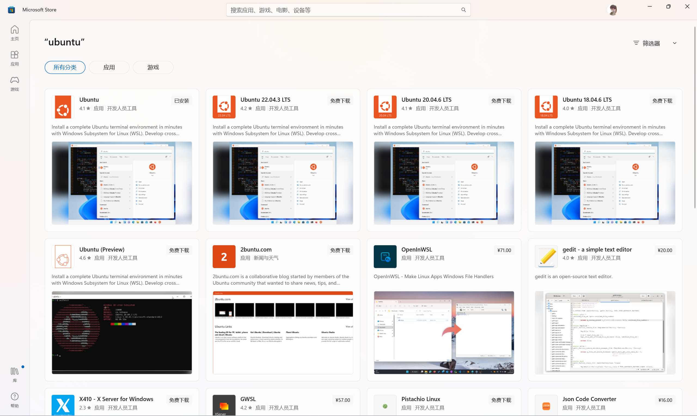
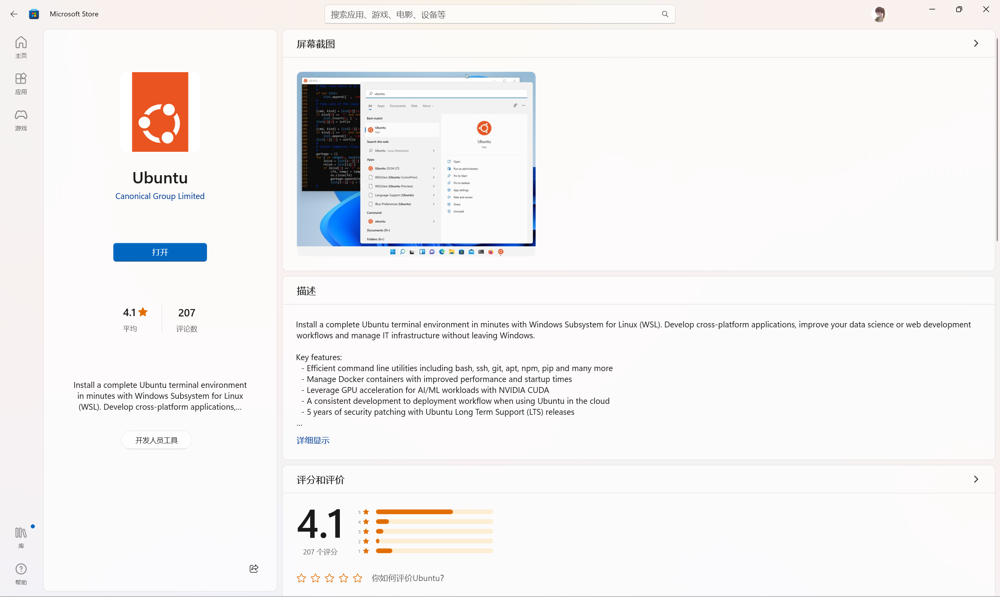
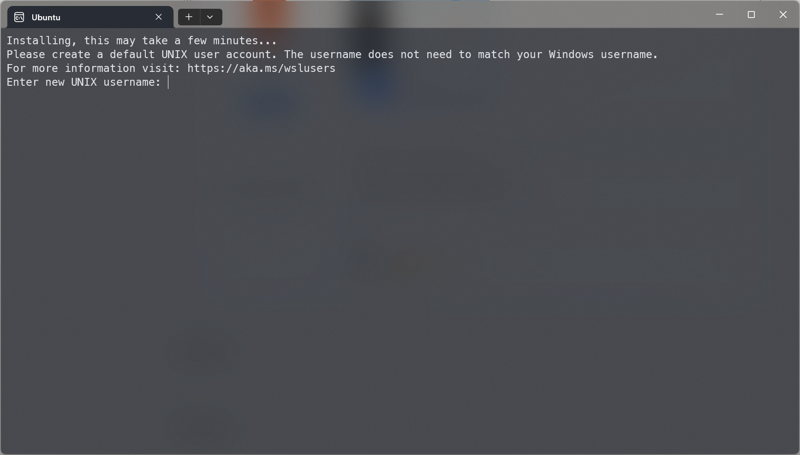
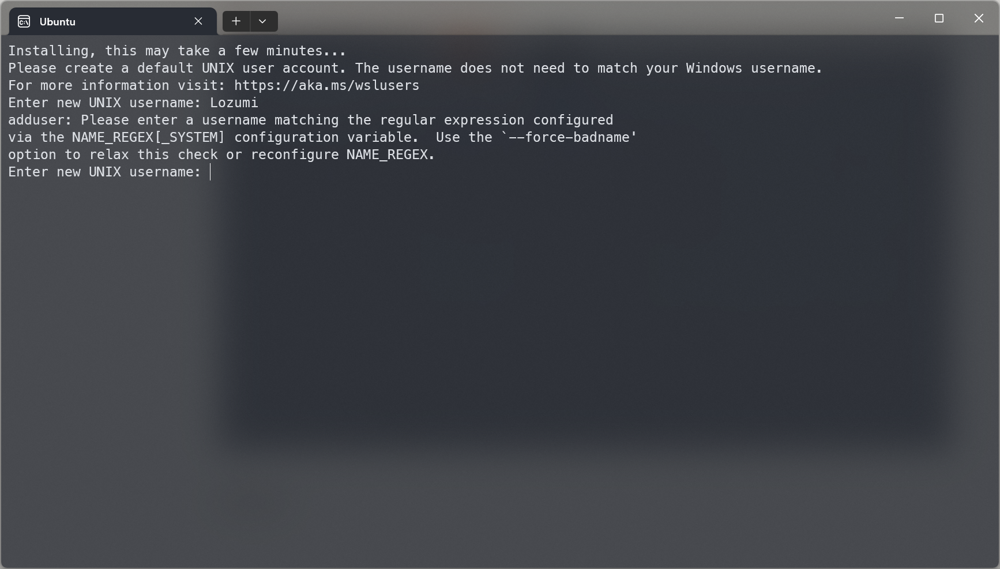
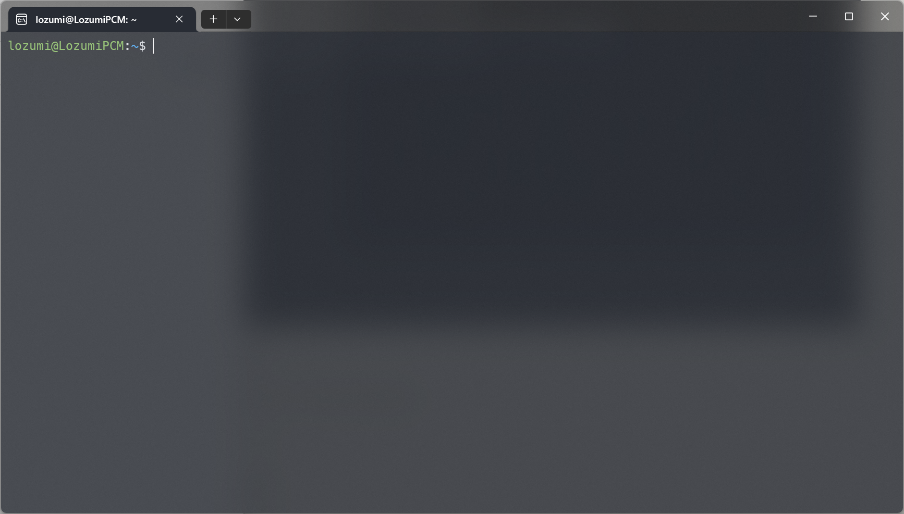

Ubuntu配置常常踩坑，WSL2安装子系统也会出现一些特殊的问题，对通用和特殊的操作进行简单总结。

# 系统安装

## 安装WSL2

略。

## 安装Ubuntu

打开微软商店，搜索Ubuntu，可以看到持续更新版本以及长期支持版本（LTS），大家按需安装。



笔者选择了持续更新版本，当前版本为22.04。点击“安装”，安装完毕后点击“打开”进入系统。



## 创建账号

使用 WSL 安装 Linux 发行版的过程完成后，使用“开始”菜单打开该发行版（默认情况下为 Ubuntu）。 系统将要求你为 Linux 发行版创建“用户名”和“密码”。

- 此**用户名**和**密码**特定于安装的每个单独的 Linux 分发版，与 Windows 用户名无关。
- 请注意，输入**密码**时，屏幕上不会显示任何内容。 这称为盲人键入。 你不会看到你正在键入的内容，这是完全正常的。
- 创建**用户名**和**密码**后，该帐户将是分发版的默认用户，并将在启动时自动登录。
- 此帐户将被视为 Linux 管理员，能够运行 `sudo` (Super User Do) 管理命令。
- 在 WSL 上运行的每个 Linux 发行版都有其自己的 Linux 用户帐户和密码。 每当添加分发版、重新安装或重置时，都必须配置一个 Linux 用户帐户。



[collapse title="WSL子系统使用独立账户"]随 WSL 一起安装的 Linux 发行版是按用户安装，不可与其他 Windows 用户帐户共享。[/collapse]

[collapse title="用户名命名规则"]遇到用户名命名错误？参考文章【Linux中的用户名命名规则】



[/collapse]

设置完毕后，便可开始使用你的Ubuntu。



# 系统配置

## 配置系统网络代理

### 临时使用

WSL2 基于 Hyper-V 运行，导致 Linux 子系统和 Windows 在网络上是两台各自独立的机器，无法直接设置代理。关键步骤在于：

1. WSL2 中配置的代理要指向宿主机DNS（ Windows ）的 IP。
2. Windows 上的代理客户端需要允许来自本地局域网的请求。

由于 Linux 子系统也是通过 Windows 访问网络，所以 Linux 子系统中的网关指向的是 Windows，DNS 服务器指向的也是 Windows，基于这两个特性，我们可以将 Windows 的 IP 读取出来。

WSL2 会把 ip 写在 `/etc/resolv.conf` 中,因此可以用 `cat /etc/resolv.conf | grep nameserver | awk '{ print $2 }'` 这条指令获得宿主机 IP。

打开 代理客户端 的 `allow lan` 功能并且查看代理端口，使用 `export ALL_PROXY="http://$host_ip:port` 指令即可成功使用代理客户端的网络代理。

例如，代理端口为7890，则可在shell中输入：

```bash
host_ip=$(cat /etc/resolv.conf |grep "nameserver" |cut -f 2 -d " ")
export ALL_PROXY="http://$host_ip:7890"
```

### 长期使用

为方便长期使用时切换代理开关，可添加脚本，并使用shell的alias命令封装方法。

新建 ~/scripts/proxy.sh，并在该脚本文件中复制以下代码：

```bash
#!/bin/sh
hostip=$(cat /etc/resolv.conf | grep nameserver | awk '{ print $2 }')
wslip=$(hostname -I | awk '{print $1}')
port=7890

PROXY_HTTP="http://${hostip}:${port}"

set_proxy(){
  export http_proxy="${PROXY_HTTP}"
  export HTTP_PROXY="${PROXY_HTTP}"

  export https_proxy="${PROXY_HTTP}"
  export HTTPS_proxy="${PROXY_HTTP}"

  export ALL_PROXY="${PROXY_SOCKS5}"
  export all_proxy=${PROXY_SOCKS5}

  git config --global http.https://github.com.proxy ${PROXY_HTTP}
  git config --global https.https://github.com.proxy ${PROXY_HTTP}

  echo "Proxy has been opened."
}

unset_proxy(){
  unset http_proxy
  unset HTTP_PROXY
  unset https_proxy
  unset HTTPS_PROXY
  unset ALL_PROXY
  unset all_proxy
  git config --global --unset http.https://github.com.proxy
  git config --global --unset https.https://github.com.proxy

  echo "Proxy has been closed."
}

test_setting(){
  echo "Host IP:" ${hostip}
  echo "WSL IP:" ${wslip}
  echo "Try to connect to Google..."
  resp=$(curl -I -s --connect-timeout 5 -m 5 -w "%{http_code}" -o /dev/null www.google.com)
  if [ ${resp} = 200 ]; then
    echo "Proxy setup succeeded!"
  else
    echo "Proxy setup failed!"
  fi
}

if [ "$1" = "set" ]
then
  set_proxy

elif [ "$1" = "unset" ]
then
  unset_proxy

elif [ "$1" = "test" ]
then
  test_setting
else
  echo "Unsupported arguments."
fi

```

可以通过如下命令控制及查看代理状态：

```bash
开启代理: source ~/scripts/proxy.sh set
关闭代理: source ~/scripts/proxy.sh unset
查看代理状态: source ~/scripts/proxy.sh test
```

为了方便使用，可在shell的配置文件中设置alias命令。配置文件取决于你使用的shell，如默认的bash对应`~/.bashrc`，zsh对应`~/.zshrc`。如使用zsh，在配置文件末位加入：

```bash
# Set Proxy
alias proxy="source ~/scripts/proxy.sh"
```

保存后，使用`source ~/.zshrc`重载配置文件。

alias命令如下：

```
开启代理: proxy set
关闭代理: proxy unset
查看代理状态: proxy test
```

## 设置使用 `sudo` 时免输密码

每次使用 sudo 时都需要输入密码确实烦人, 毕竟是私人电脑, 安全性有锁屏密码保护就可以了, 为了使用方便, 不仿取消使用 sudo 时需要输入 root 用户密码的设定:

打开终端, 输入

```bash
 sudo vim /etc/sudoers
```

将

```sh
%sudo ALL=(ALL:ALL) ALL
```

改为：

```sh
%sudo ALL=(ALL:ALL) NOPASSWD:ALL
```

即可。

# 系统美化

## 安装zsh

Shell是Linux/Unix的一个外壳，负责外界与Linux内核的交互，接收用户或其他应用程序的命令，然后把这些命令转化成内核能理解的语言，再把结果返回用户或应用程序。而zsh是一款功能强大的Shell。

安装zsh

```
sudo apt-get install zsh
```

把默认的Shell改成zsh

```
chsh -s /bin/zsh
```

zsh的配置和美化比较繁琐，一般使用oh-my-zsh进行配置。详见文章【Ubuntu下zsh和oh-my-zsh的安装、配置和美化】。

